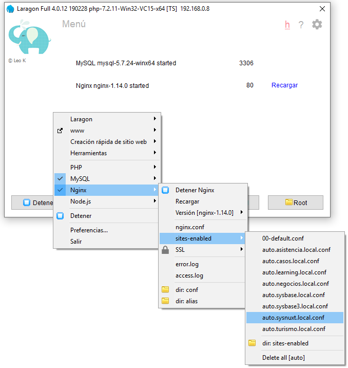
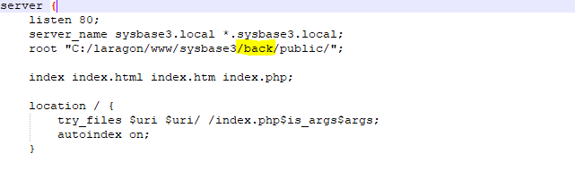
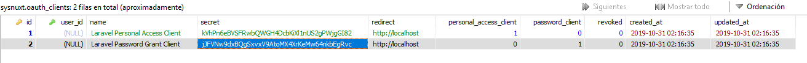

## SYSNUXT

    Sistema base echo con laravel para el backend y nuxt para el frontend
    
## Instalación
 
 ### Programas necesarios

  #### Laragon https://sourceforge.net/projects/laragon/files/releases/4.0/laragon-full.exe
        
  #### Visual studio code  https://code.visualstudio.com/Download    
 
 ### Crear una base de datos llamada sysnuxt
   
     (Esto en cualquier administrador de base de datos como heidi)
     
 ### Configuraciones para laragon
 
 #### Cambiara {name}.test por {name}.local
     
  
 #### Desmarcar casilla de apache, marcar casilla de Nginx y cambiar el puerto del mismo a 80
 
 
     
  ### Ejecutar los siguientes comando en la terminal que incluye laragon 
  
  
    
  
  ##### Instalar npx
  
    npm install -g npx
  
  ##### clonar repo
    git clone https://github.com/soluciones-altamirano/sysnuxt.git

  ##### Acceder a la carpeta del backend
    cd sysnuxt/back
    
  ##### instalar dependencias
    composer install
    
  #### crear archivo de entornos del backend
    cp .env.example .env
    
    
  ##### generar clave de encartación para seguridad de la aplicación
    php artisan key:generate  
    
  ##### Instalar clientes por defecto de Laravel Passport (Autenticación para apis) 
    php artisan passport:install
    
  ##### crear tablas y datos
    php artisan migrate --seed
   
   
  ##### Editar Virtual Host (Dejar consola abierta)
    
  
    
      agregar /back/public a root
    
  
  
  guarda el archivo
  
  ### Recargar servidor web de laragon para que se genere el virtual host
  
  
  
  ##### Acceder a la carpeta del front (Terminal que dejaste abierta)
    
    cd ../front
          
  ##### instalar dependencias
    npm install 		 

 
  #### crear archivo de entornos del frontend
    cp .env.example .env   
  
  #### edita el archivo .env
    
    PASSPORT_PASSWORD_GRANT_SECRET=<campo secret tabla oauth_clients segundo registro>
    
    
  
  #### correr aplicacion front
      npm run dev  
      
  ### Puedes ingresar por el navegador con http://localhost:3333/   
     
  #### Credenciales de acceso
    Usuario : admin
    Password : admin
 

